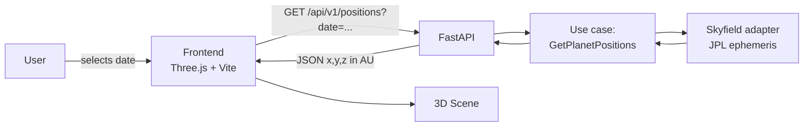
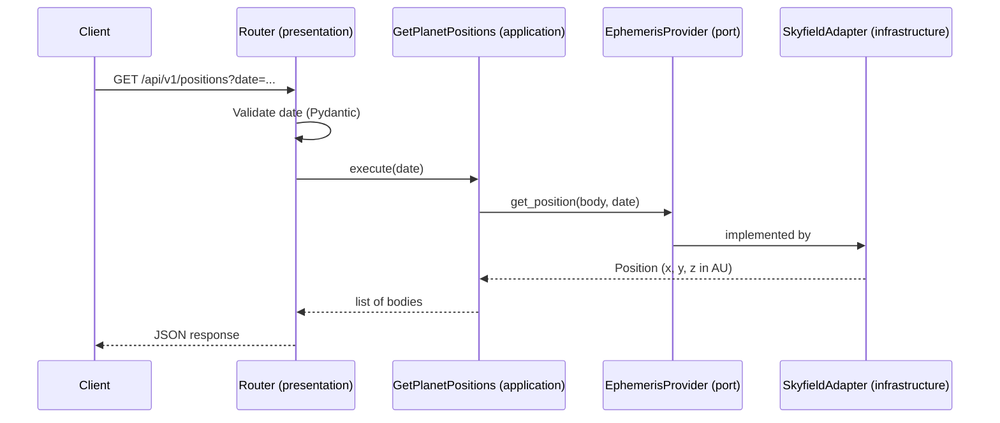

# Solar System Simulator

Interactive 3D simulator that shows the real astronomical positions of the planets relative to the Sun for any date chosen by the user.

> **Status**: under active development: Milestone 1 (project foundation) done.

## Architecture

The system is a decoupled monorepo: a Python REST API computes position from JPL ephemerides, and a Three.js client renders them.



### Backend layers (Clean Architecture)

Dependencies point inwards only: `presentation → application → domain`. `infrastructure` implements the ports defined in `application`.

| Layer | Responsibility |
|---|---|
| `domain` | Celestial body entities and business rules (no external deps) |
| `application` | Use cases and ports (interfaces) |
| `infrastructure` | Skyfield adapter, ephemeris loading |
| `presentation` | FastAPI routers and Pydantic schemas |

## Tech stack

| Area | Tools |
|---|---|
| Backend | Python 3.10, FastAPI, Pydantic, Skyfield |
| Frontend | JavaScript (ES6+), Three.js, Vite |
| Quality | Ruff, mypy, pytest, pre-commit |
| DevOps | uv, Docker, Docker Compose, GitHub Actions |

## Project structure

```text
solar-system-simulator/
├── .github/workflows/   # CI pipelines
├── backend/             # FastAPI service (src layout)
├── frontend/            # Three.js client
├── docs/                # Architecture diagrams and ADRs
└── docker-compose.yml
```

## Getting started

### Requirements

- [uv](https://docs.astral.sh/uv/)
- [Docker](https://www.docker.com/) (optional)

### Run locally

```bash
cd backend
uv sync
uv run uvicorn solar_system.presentation.main:app --reload
```

### Run with Docker

```bash
docker compose up --build
```

The API is then available at `http://localhost:8000`.

## Coordinate conventions

All positions returned by the API are **heliocentric, geometric, ecliptic J2000,
in astronomical units (AU)**. See
[ADR 0001](docs/adr/0001-reference-frame.md) for the rationale. Mapping to
the 3D scene (axes and scale) is done by the frontend
([ADR 0002](docs/adr/0002-axes-and-scale-in-frontend.md)).

Calculations are validated against JPL Horizons vector tables
([ADR 0003](docs/adr/0003-validation-against-jpl-horizons.md)).

## API documentation

FastAPI generates OpenAPI docs automatically:

- Swagger UI: `http://localhost:8000/docs`
- OpenAPI schema: `http://localhost:8000/openapi.json`


| Method | Endpoint | Status | Description |
|--------|----------|--------|-------------|
| GET    | `/health`|Available|Service health check|
| GET | `/api/v1/positions?date=<ISO-8601>` | Planned | Positions of the Sun and the 8 planets for a date |

Planned response:

```json
{
  "date": "2000-01-01T12:00:00Z",
  "frame": "ecliptic-J2000",
  "origin": "sun",
  "unit": "AU",
  "bodies": [
    { "name": "earth", "position": { "x": -0.177135, "y": 0.967242, "z": -0.000004 } }
  ]
}
```

### Position request flow



## Development

```bash
cd backend
uv run ruff check .          # lint
uv run ruff format .         # format
uv run mypy src              # type checking
uv run pytest                # tests + coverage
```

Commits follow [Conventional Commits](https://www.conventionalcommits.org/).

## Roadmap

- [x] **Milestone 1:** Monorepo, tooling, Docker, health endpoint, CI
- [ ] **Milestone 2:** Positions endpoint and calculation logic (TDD against known data)
- [ ] **Milestone 3:** Three.js scene and API client
- [ ] **Milestone 4:** Testing, documentation and optimization

## License

MIT
