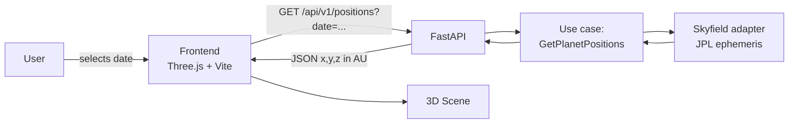
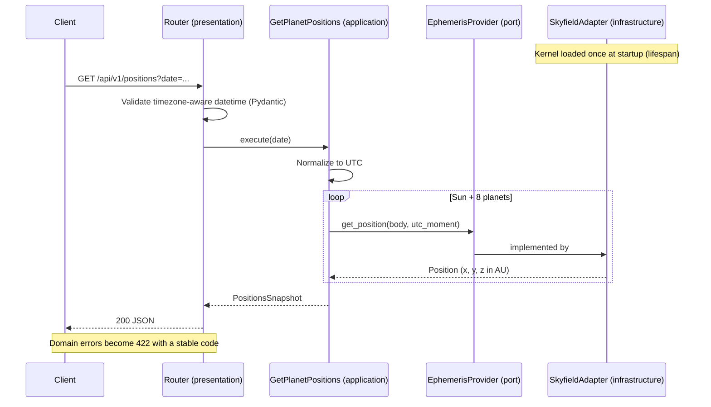

# Solar System Simulator

[](https://github.com/Matute0512/solar-system-simulator/actions/workflows/backend-ci.yml)

Interactive 3D simulator that shows the real astronomical positions of the planets relative to the Sun for any date chosen by the user.

> **Status**: under active development: Milestone 2 (calculation engine and REST API) done; the 3D frontend is next.

## Architecture

The system is a decoupled monorepo: a Python REST API computes positions from JPL ephemerides, and a Three.js client renders them.



### Backend layers (Clean Architecture)

Dependencies point inwards only: `presentation → application → domain`. `infrastructure` implements the ports defined in `application`.

| Layer | Responsibility |
|---|---|
| `domain` | Celestial body entities and business rules (no external deps) |
| `application` | Use cases and ports (interfaces) |
| `infrastructure` | Skyfield adapter, ephemeris loading |
| `presentation` | FastAPI routers, Pydantic schemas, error handling, startup wiring |

## Tech stack

| Area | Tools |
|---|---|
| Backend | Python 3.10, FastAPI, Pydantic, Skyfield (JPL DE440s) |
| Frontend | *Planned (Milestone 3):* JavaScript (ES6+), Three.js, Vite |
| Quality | Ruff, mypy (strict), pytest |
| DevOps | uv, Docker, Docker Compose, GitHub Actions |

## Project structure

```text
solar-system-simulator/
├── .github/workflows/   # CI pipelines
├── backend/             # FastAPI service (src layout)
├── frontend/            # Three.js client
├── docs/                # Architecture diagrams and ADRs
└── docker-compose.yml
```

## Getting started

### Requirements

- [uv](https://docs.astral.sh/uv/)
- [Docker](https://www.docker.com/) (optional)

### Run locally

> The first run downloads the ephemeris kernel (~32 MB) into `backend/data/`.
> Run the command from the `backend/` directory.

```bash
cd backend
uv sync
uv run uvicorn solar_system.presentation.main:app --reload
```

### Run with Docker

> The kernel is downloaded while building the image, so the container needs no network at runtime.

```bash
docker compose up --build
```

The API is then available at `http://localhost:8000`.

## Architecture decisions

| ADR | Decision |
|---|---|
| [0001](docs/adr/0001-reference-frame.md) | Heliocentric, geometric, ecliptic J2000 frame, in AU |
| [0002](docs/adr/0002-axes-and-scale-in-frontend.md) | Axis mapping and scale belong to the frontend |
| [0003](docs/adr/0003-validation-against-jpl-horizons.md) | Validate against JPL Horizons |
| [0004](docs/adr/0004-barycenters-for-mars-and-outer-planets.md) | Barycenters for Mars and the outer planets |
| [0005](docs/adr/0005-use-de440s-kernel.md) | Use the DE440s kernel |
| [0006](docs/adr/0006-fail-fast-and-bundled-kernel.md) | Bundle the kernel in the image and fail fast |

## API documentation

FastAPI generates OpenAPI docs automatically:

- Swagger UI: `http://localhost:8000/docs`
- OpenAPI schema: `http://localhost:8000/openapi.json`

| Method | Endpoint | Description |
|---|---|---|
| GET | `/health` | Service health check |
| GET | `/api/v1/positions?date=<ISO-8601>` | Positions of the Sun and the 8 planets for an instant |

Example:

```bash
curl "http://localhost:8000/api/v1/positions?date=2000-01-01T12:00:00Z"
```

Example response:

```json
{
  "date": "2000-01-01T12:00:00Z",
  "frame": "ecliptic-J2000",
  "origin": "sun",
  "unit": "AU",
  "bodies": [
    { "name": "earth", "position": { "x": -0.177135, "y": 0.967242, "z": -0.000004 } }
  ]
}
```

(The real response lists the Sun and the eight planets; one body is shown here.)

> In URLs, write `+` in a UTC offset as `%2B` (or use `Z`), because a raw `+`
> is decoded as a space.

### Errors

Invalid requests return **422** with a stable machine-readable code:

```json
{ "code": "date_out_of_range", "detail": "No ephemeris data available for ..." }
```

| Code | Cause |
|---|---|
| `date_out_of_range` | The instant is outside the 1849-2150 ephemeris range |
| `naive_datetime` | The date has no timezone |

Malformed dates and missing parameters use FastAPI's standard 422 body.

## Configuration

| Variable | Default | Description |
|---|---|---|
| `SOLAR_DATA_DIR` | `data` | Directory holding the ephemeris kernel (`/app/data` in the image) |

The application refuses to start if the kernel cannot be loaded
([ADR 0006](docs/adr/0006-fail-fast-and-bundled-kernel.md)).

### Position request flow



## Development

```bash
cd backend
uv run ruff check .          # lint
uv run ruff format .         # format
uv run mypy src              # type checking
uv run pytest                # tests + coverage
```

Commits follow [Conventional Commits](https://www.conventionalcommits.org/).

## Testing

- **Unit tests** for the domain and the use case (with a fake ephemeris provider).
- **Integration tests** for the Skyfield adapter, validated against JPL Horizons
  vectors for the eight planets at two epochs (tolerance: 1e-6 AU).
- **API tests** for the contract, validation and error translation.
- **Startup test** that loads the real kernel and checks the Earth against Horizons.

## Roadmap

- [x] **Milestone 1:** Monorepo, tooling, Docker, health endpoint, CI
- [x] **Milestone 2:** Positions endpoint and calculation logic (TDD against known data)
- [ ] **Milestone 3:** Three.js scene and API client
- [ ] **Milestone 4:** Testing, documentation and optimization

## License

MIT
